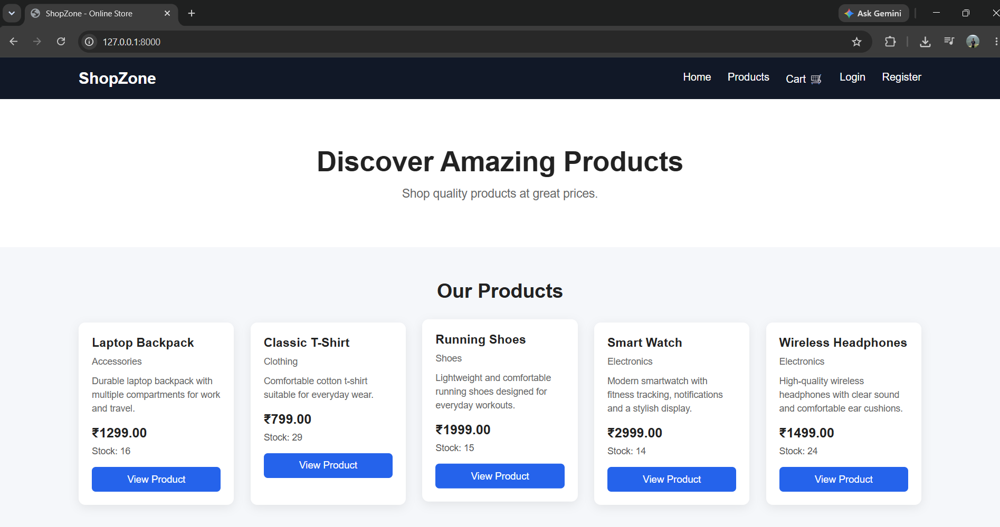
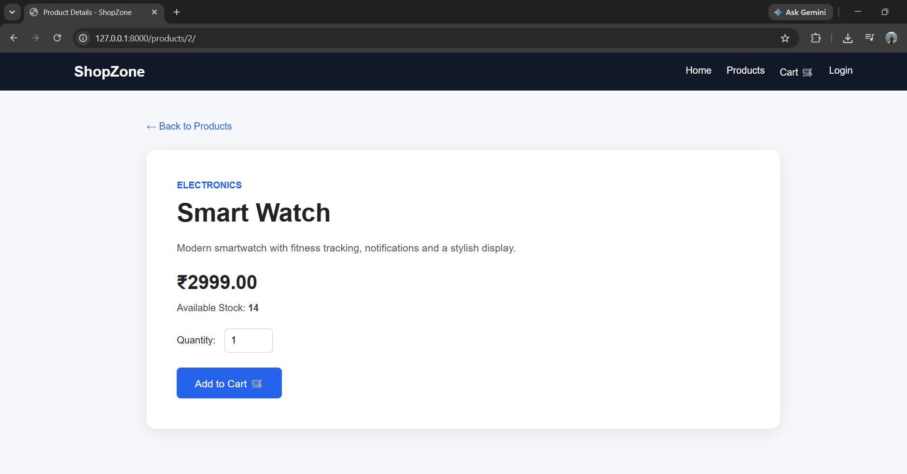
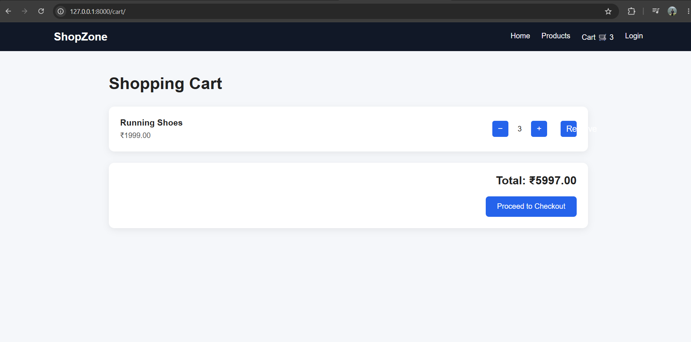
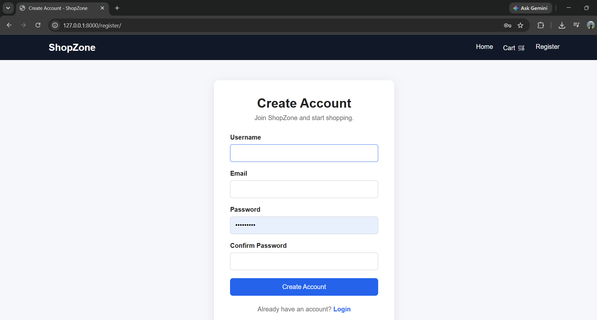
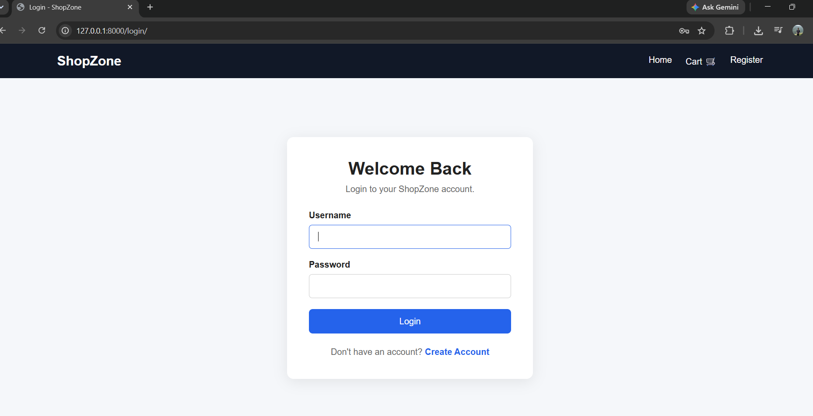
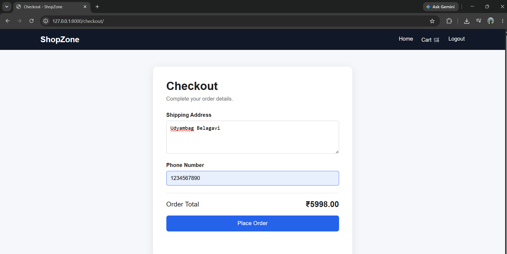
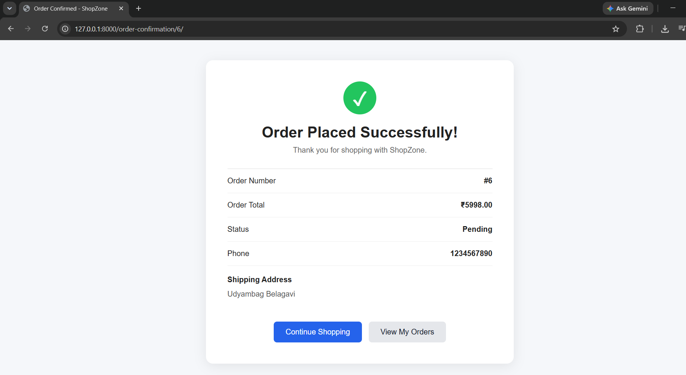
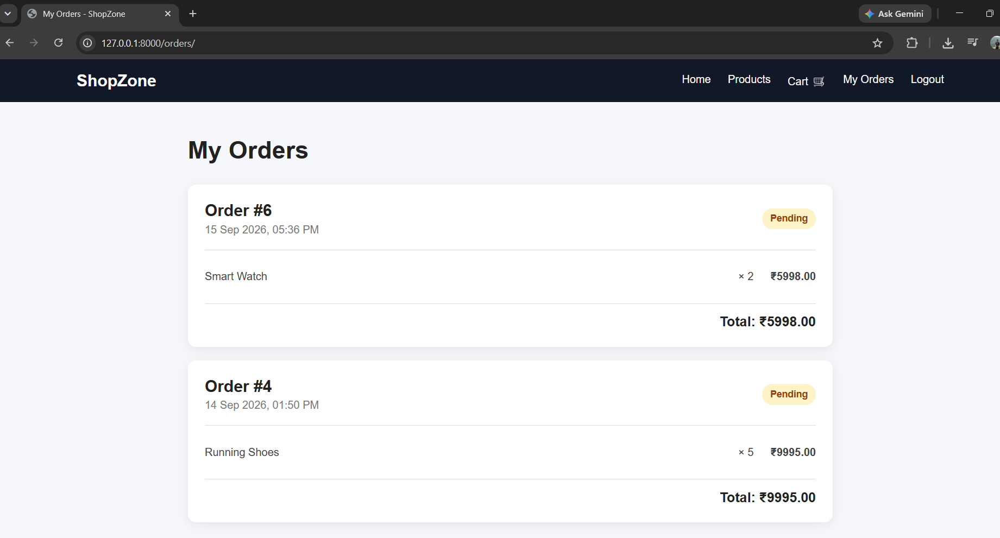

# CodeAlpha E-commerce Store

A simple full-stack e-commerce web application built using Django, Django REST Framework, HTML, CSS, and JavaScript.

## Features

- Product listing
- Product details page
- Shopping cart
- Add, remove, and update cart items
- User registration
- User login and logout
- User authentication and protected pages
- Checkout and order processing
- Stock availability validation
- Order confirmation
- User-specific order history
- Django admin panel
- REST API for products
- SQLite database

## Technologies Used

- Python
- Django
- Django REST Framework
- HTML5
- CSS3
- JavaScript
- SQLite
- Git and GitHub

## Project Structure

CodeAlpha_Ecommerce/
    ecommerce/
    products/
    store/
    templates/
    static/
        css/
        js/
    manage.py
    .gitignore
    README.md

## Installation

### 1. Clone the repository

git clone https://github.com/sourabhsk24/CodeAlpha_Ecommerce.git

cd CodeAlpha_Ecommerce

### 2. Create a virtual environment

Windows:

python -m venv venv

venv\Scripts\activate

### 3. Install dependencies

pip install django djangorestframework

### 4. Apply database migrations

python manage.py migrate

### 5. Create an admin account

python manage.py createsuperuser

### 6. Start the development server

python manage.py runserver

Open the application in your browser:

http://127.0.0.1:8000/

## Admin Panel

Django admin panel:

http://127.0.0.1:8000/admin/

Administrators can manage products, categories, orders, and order items.

## Order Processing

The application validates product stock during checkout and calculates the order total using product prices stored in the database.

Orders are associated with the authenticated user, and users can view their own order history through the My Orders section.

## Future Improvements

- Payment gateway integration
- Product search and filtering
- Product reviews and ratings
- Wishlist functionality
- Improved responsive design
- Order status tracking
- Product image upload

## Author

Sourabh

GitHub:
https://github.com/sourabhsk24

## Project

This project was developed as part of the CodeAlpha Internship - Task 1: Simple E-commerce Store.

## Screenshots

### Home Page

### Product Details

### Shopping Cart

### User Registration

### Login

### Checkout

### Order Confirmation

### My Orders
